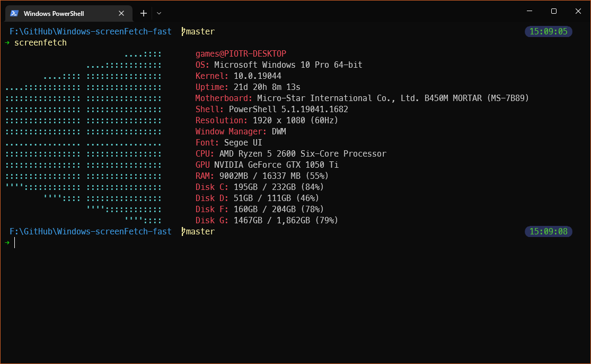
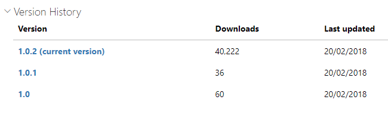
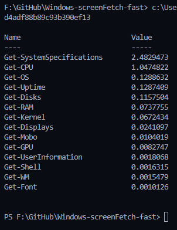
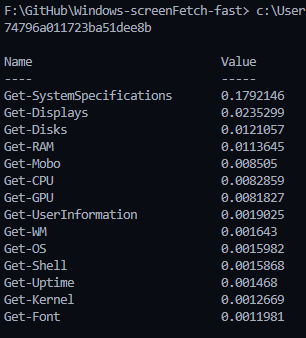

# Fast Windows ScreenFetch



This is a fork of [Windows-screenFetch](https://github.com/JulianChow94/Windows-screenFetch) that aims to be faster.

## Why?

I wanted to use it as a splash screen.

The original is really slow (at least as of me writing this) and hasn't been updated since 2018:



## Installation

Windows screenFetch is available and managed through [Powershell Gallery](https://www.powershellgallery.com/packages/windows-screenfetch).

```pwsh
Install-Module -Name windows-screenfetch-fast
```

Simply run the `screenfetch` command after installing the module and you should be good to go.

## How much faster?

Around 15 times (2.48s to 0.17s)

> Value unit is `seconds`

| Before  | After |
| ------------- | ------------- |
|   |   |